# frontend-ConnectUrPet

This project is a pet adoption app made in Kotlin. You can enter as an adopter or a giver and which backend you.

If the account is an adopter, you can swipe through pet profiles, like the ones you are interested in, and view their details. You can also see the pet’s vaccines and care tips generated using the ChatGPT API. You can see the information of the giver and see or leave reviews.

If the account is a giver, you can add and edit your pet information and see which adopters have liked your pets. Both types of accounts can edit their profile information.

  
App screenshots

  
  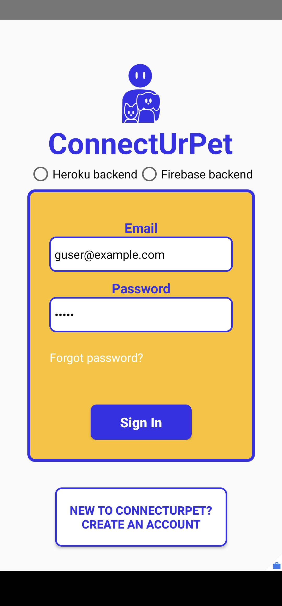
  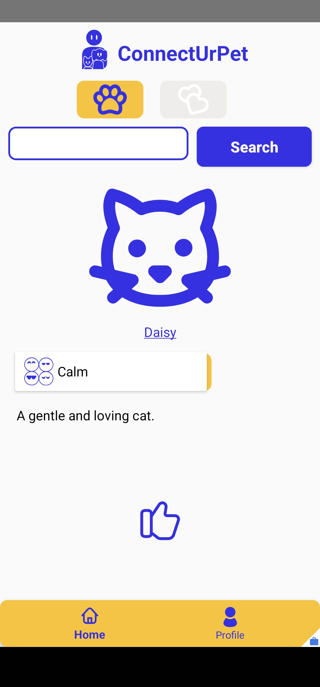
  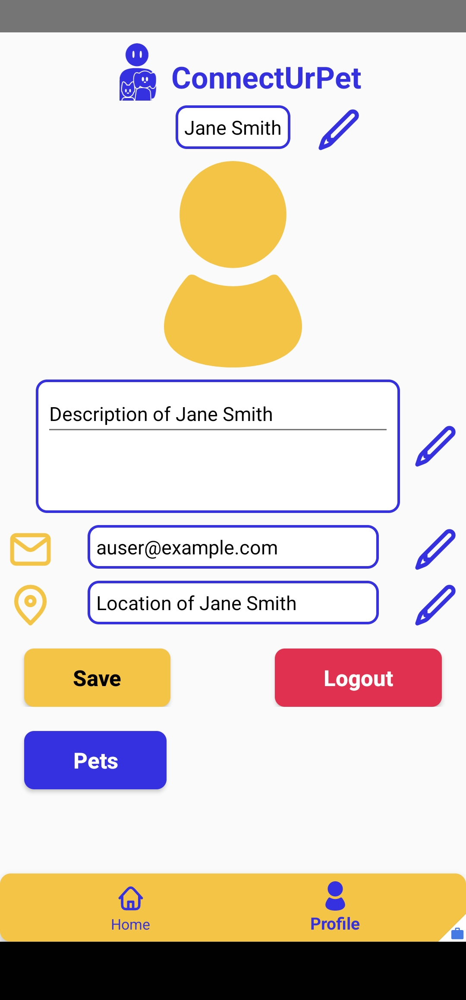
  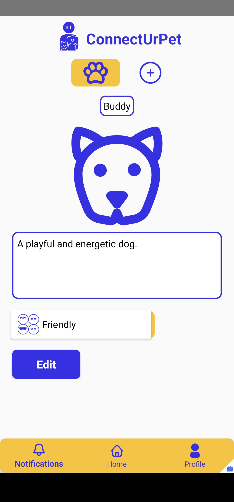
  
  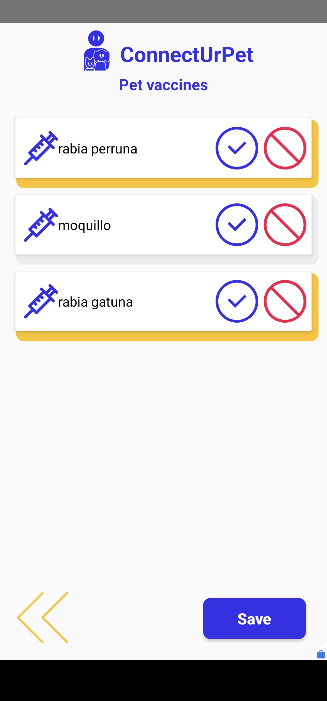
  
  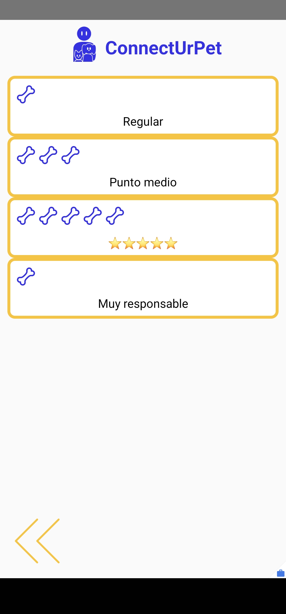
  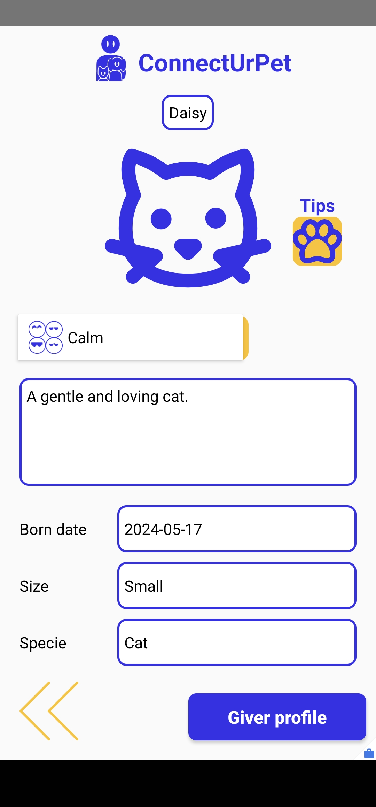
  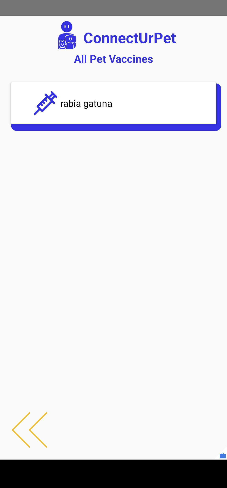
  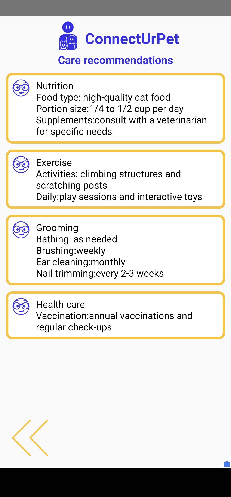
  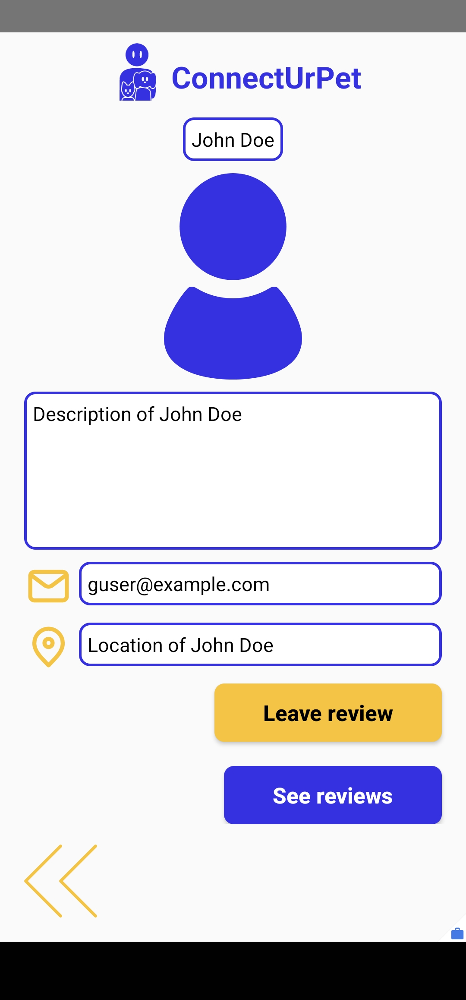
  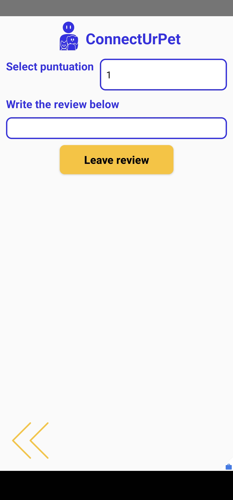

