# Frontend-ConnectUrPet

An double-sided pet adoption mobile application built in Kotlin. The system bridges the gap between pet adopters and givers through an interactive swipe-based interface and AI-driven pet care insights.

-> [ConnectUrPet - backend services](https://github.com/AriSV05/be-ConnectUrPet) <-

  
App screenshots

  
  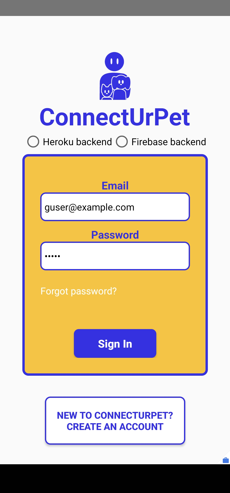
  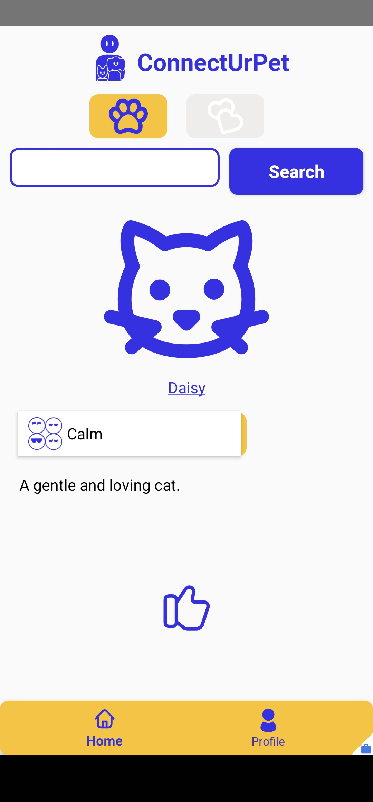
  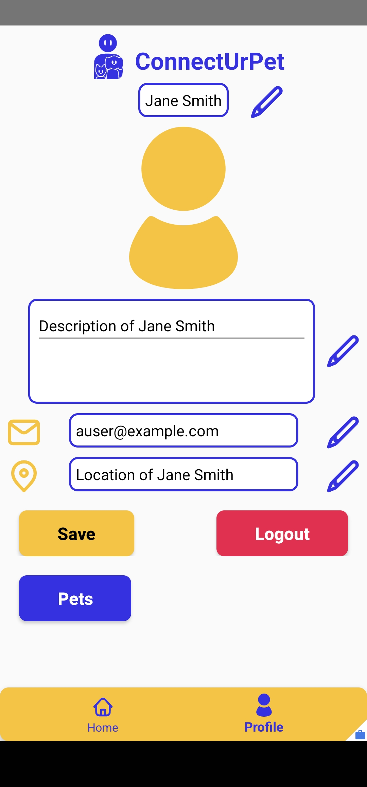
  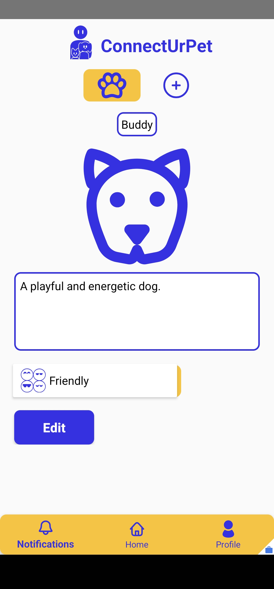
  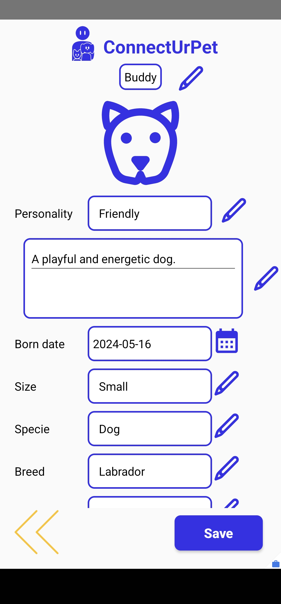
  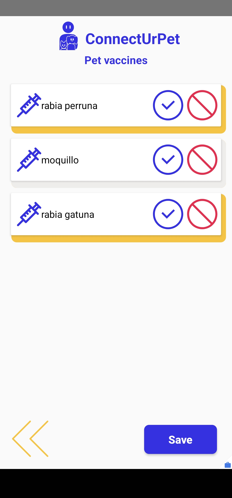
  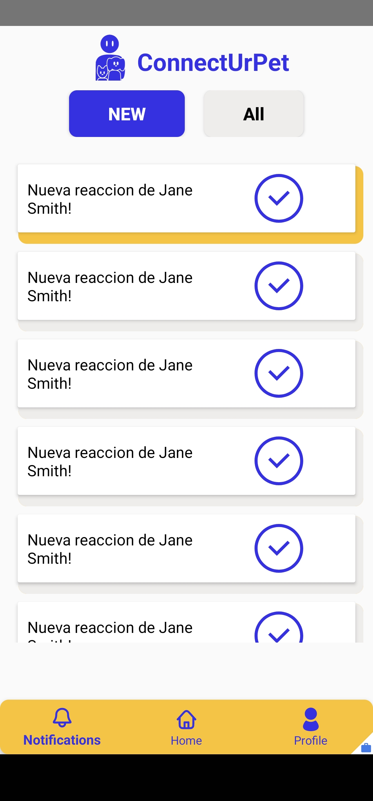
  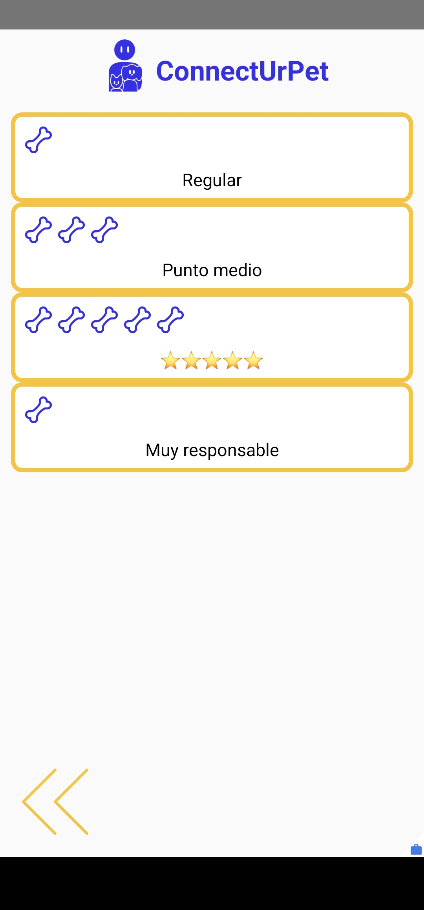
  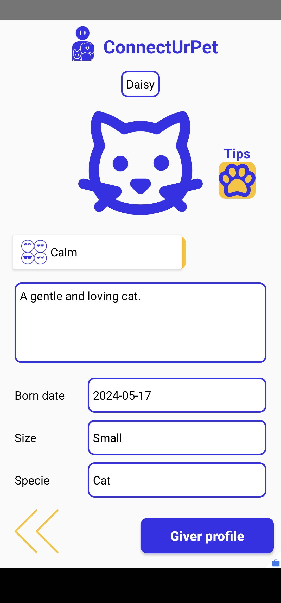
  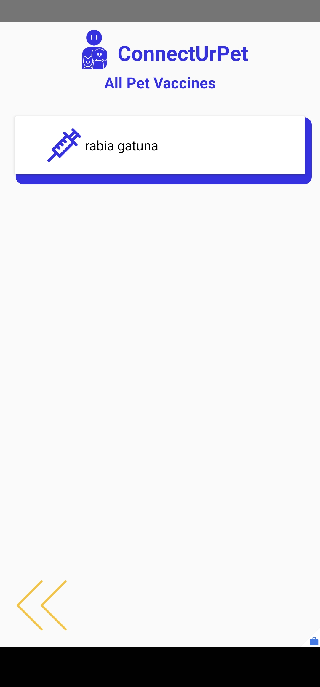
  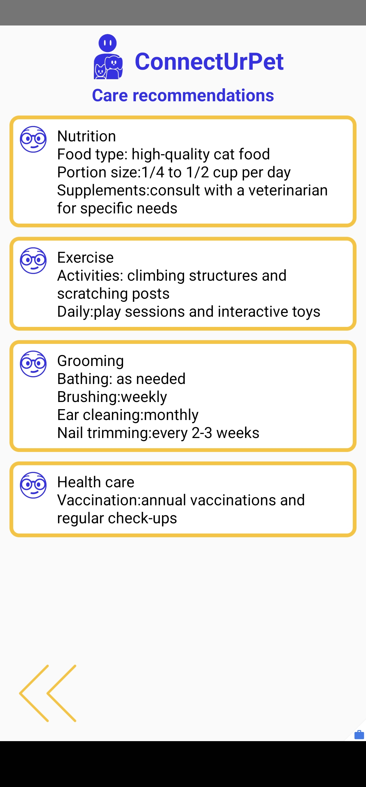
  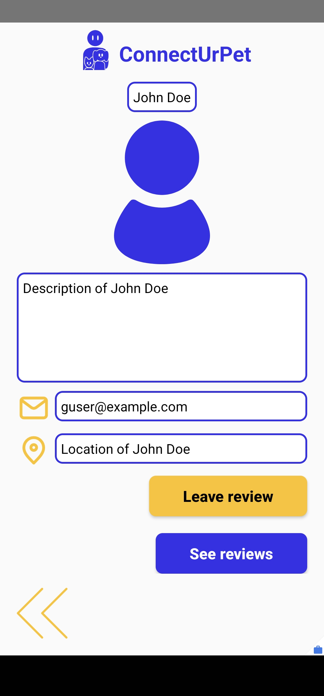
  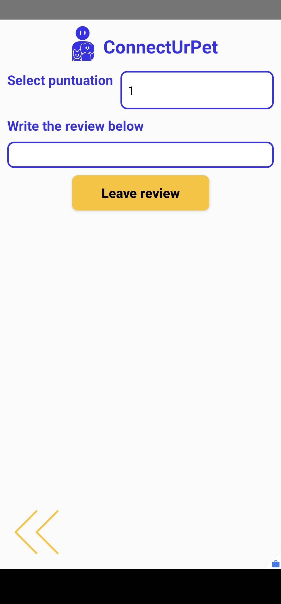

---
### 1. Architectural Pattern: Clean Architecture + MVVM
*   **Decoupling:** Implemented MVVM to cleanly separate the presentation layer from the domain and data layers. This allows the app to swap backend configurations seamlessly without affecting the UI logic.

### 2. Multi-Backend Agility
*   The application features a unique architecture that allows the user to toggle between different backend implementations. 
*   By abstracting network requests behind a strict repository pattern interface, the frontend remains agnostic of whether it is consuming a monolithic or microservice-oriented infrastructure.
---

### Adopter Experience
*   **Interactive Matchmaking UI:** A gesture-driven swipe interface to browse the pet profiles.
*   **AI-Powered Care Insights:** Integrated OpenAI's ChatGPT API via the backend to dynamically custom care tips for each pet based on breed, age, and health status.
*   **Social System:** Read and write feedback loop via user reviews to build trust within the community.

### Giver Experience
*   **Inventory & Profile Management:** Complete CRUD system to list, edit, and monitor pet profiles.
*   **Interest Tracking:** Real-time visibility into which adopters have "liked" their pets to streamline the adoption pipeline.
---

### Roadmap & Project Management Chronology

The project was planned and executed using an agile framework, with continuos reports of updates.

*   **Phase 1:**
    *   Designed core domain entities (Adopters, Givers, and Pets) and mapped their relationships.
    *   Created low-fidelity screen mocks and defined user navigation flows.
    *   Set up the base Kotlin project structure, architecture layers (MVVM), and dependency injection configurations.
*   **Phase 2:**
    *   Prototype integrating Google's services and built the frontend login screens to quickly validate user's workflow.
    *   Developed the main swipe mechanic and interactive pet dashboards using the data in Firebase.
*   **Phase 3:**
    *   Engineered and deployed a secondary standalone backend service using **Kotlin** hosted on **Heroku**
    *   Implemented a secure **Token-Based Authentication system** within the Kotlin backend
*   **Phase 4:**
    *   Applied the Bridge and Repository patterns on the mobile app to abstract the networking layer, this way, the fronted can consume both backend services.
---

### Stack

*   **Language:** Kotlin and JavaScript
*   **Backend Services:** Kotlin-Heroku and JavaScript-Google Cloud Functions
*   **Databases:** PostgreSQL and Firebase
*   **Networking:** Retrofit2
*   **Architecture:** MVVM, Repository Pattern, Clean Architecture
